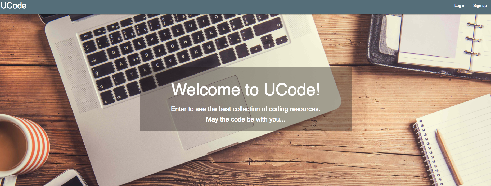
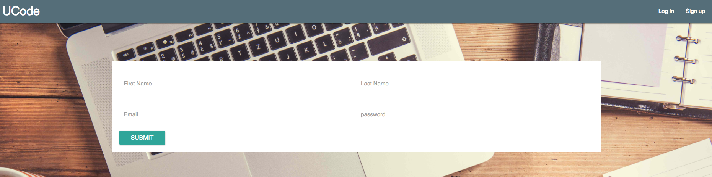
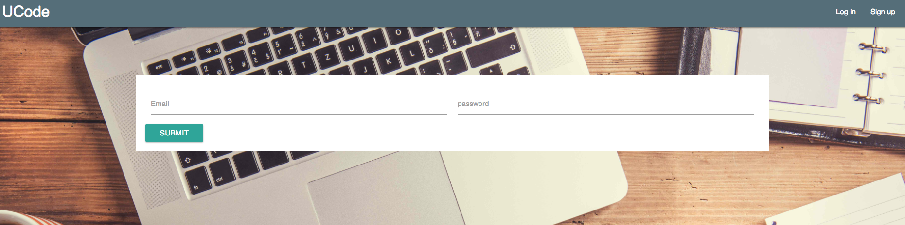
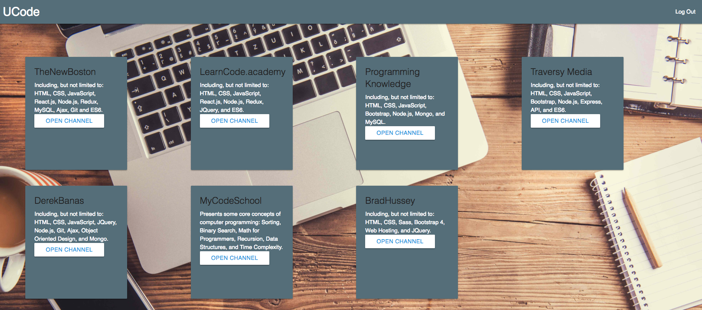
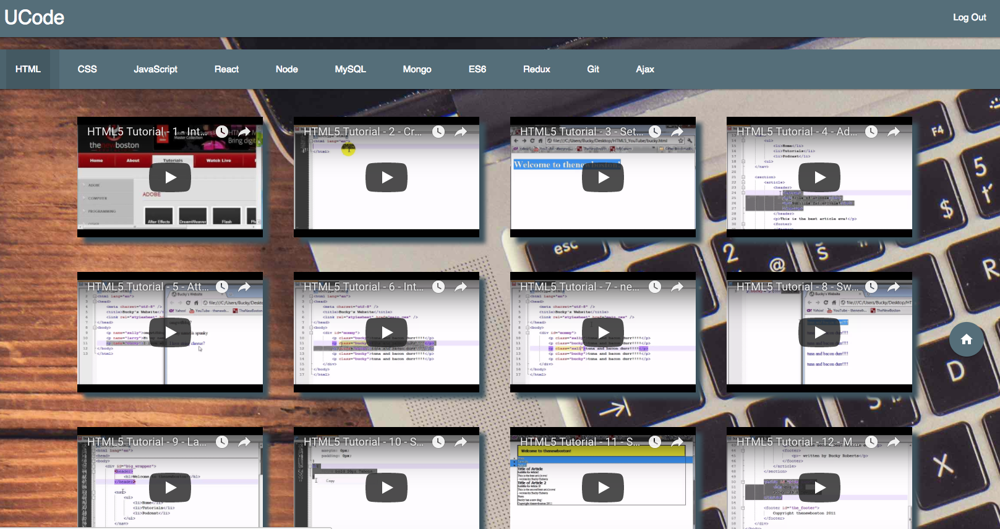

# UCode

The enclosed repository includes a video streaming application of the best coding resources built using Node, Express, React, MySQL and Passport.

A demo of the application can be found at: https://rocky-caverns-52053.herokuapp.com/

To run the application locally, clone the attached repo, install the node dependencies (npm install) and run node server.js from the client.

Below are a few screen shots of the final application:

Main Landing Page:

Signup Page (Passport JS and JWT is used for user authentication):

Login Page:

Welcome Page:

Sample Channel:

